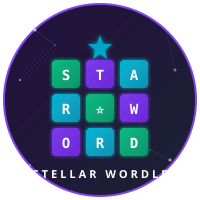

<p align="center">
  
</p>

<h1 align="center">🌟 Stellar Wordle</h1>

<p align="center">
  <strong>A fully on-chain Wordle game built on Stellar Soroban</strong>
</p>

<p align="center">
  <a href="https://stellar.expert/explorer/testnet/contract/CDZ2GAIMY43JBGJMY2H6ZZUD6F4M35VZ3N7I2C3CH4DRUWW6O6RQ7KCB">
    
  </a>
  <a href="https://github.com/rooseeeeee/wordle">
    
  </a>
  
  
</p>

---

## 📖 Project Description

Stellar Wordle is a decentralized word-guessing game deployed on the **Stellar Soroban** smart contract platform. Players connect their Stellar wallet and attempt to guess a 5-letter word in 6 tries, receiving green, yellow, and gray tile feedback — all validated on-chain. The game features a campaign mode with multiple levels, player statistics, and a global leaderboard, wrapped in a stunning night observatory visual theme.

**Free-to-play. No tokens required. Just connect and play.**

| | |
|---|---|
| **Contract ID** | `CDZ2GAIMY43JBGJMY2H6ZZUD6F4M35VZ3N7I2C3CH4DRUWW6O6RQ7KCB` |
| **Network** | Stellar Testnet |
| **Explorer** | [View on Stellar Expert](https://stellar.expert/explorer/testnet/contract/CDZ2GAIMY43JBGJMY2H6ZZUD6F4M35VZ3N7I2C3CH4DRUWW6O6RQ7KCB) |

---

## 🔭 Project Vision

Stellar Wordle demonstrates that fun, interactive gaming experiences can live entirely on-chain without sacrificing UX. Our vision:

- **Prove Soroban's capability** for real-time, interactive dApps beyond DeFi
- **Onboard new users** to Stellar through an accessible, familiar game mechanic
- **Showcase best practices** for Soroban smart contract development and frontend integration
- **Build community** through competitive leaderboards and daily challenges

---

## ✨ Key Features

| Feature | Description |
|---------|-------------|
| 🎮 **Classic Wordle** | 5 letters, 6 guesses, daily word rotation |
| 🏕️ **Campaign Mode** | Multiple levels with auto-generated words per level |
| 🟩 **On-chain Validation** | Green/yellow/gray feedback computed by the smart contract |
| 📊 **Player Stats** | Win streaks, guess distribution, games played — all on-chain |
| 🏆 **Leaderboard** | Global ranking of top players |
| ⌨️ **Keyboard Support** | Full physical keyboard input with visual feedback |
| 👛 **Wallet Connect** | Seamless Stellar wallet integration via Stellar Wallet Kit |
| 🌌 **Observatory Theme** | Deep space dark UI with constellation motifs and neon tile glow |
| 🆓 **Free-to-Play** | No tokens, no fees — testnet powered |

---

## 🛠️ Tech Stack

### Smart Contract
| Technology | Version | Purpose |
|-----------|---------|---------|
| Soroban (Rust) | — | Smart contract runtime |
| soroban-sdk | 22.0.6 | Contract development framework |

### Frontend
| Technology | Version | Purpose |
|-----------|---------|---------|
| Next.js | 16 | React framework with App Router |
| React | 19 | UI component library |
| TypeScript | 5 | Type-safe development |
| Tailwind CSS | v4 | Utility-first styling |
| Stellar Wallet Kit | 2 | Wallet connection & signing |
| TanStack Query | 5 | Async state management |
| Framer Motion | 12 | Animations & transitions |
| Sonner | latest | Toast notifications |

---

## 🏗️ Architecture

```
┌─────────────────────────────────────────────────────────┐
│                     Frontend (Next.js 16)                │
│  ┌───────────┐  ┌──────────────┐  ┌─────────────────┐  │
│  │  Game UI  │  │  Wallet Kit  │  │  TanStack Query │  │
│  └─────┬─────┘  └──────┬───────┘  └────────┬────────┘  │
│        │               │                    │           │
│        └───────────────┼────────────────────┘           │
│                        │                                │
└────────────────────────┼────────────────────────────────┘
                         │ Soroban RPC
                         ▼
┌─────────────────────────────────────────────────────────┐
│              Stellar Testnet (Soroban)                   │
│  ┌────────────────────────────────────────────────────┐ │
│  │           Wordle Smart Contract                    │ │
│  │  ┌──────────┐ ┌───────────┐ ┌──────────────────┐  │ │
│  │  │ Game Mgmt│ │ Evaluation│ │ Stats/Leaderboard│  │ │
│  │  └──────────┘ └───────────┘ └──────────────────┘  │ │
│  └────────────────────────────────────────────────────┘ │
└─────────────────────────────────────────────────────────┘
```

**Data Flow:**
1. Player connects wallet via Stellar Wallet Kit
2. Frontend invokes contract functions through Soroban RPC
3. Contract validates guesses and returns tile feedback
4. TanStack Query caches responses for reactive UI updates
5. Framer Motion animates tile reveals and keyboard state

---

## 📜 Smart Contract API

### Functions

| Function | Access | Description |
|----------|--------|-------------|
| `__constructor` | Init | Initializes contract state on deployment |
| `set_word` | Admin | Sets the daily word for the current day/level |
| `get_word` | Public | Retrieves the current word (see ADR-001) |
| `get_day` | Public | Returns the current game day identifier |
| `start_game` | Player | Initializes a new game session for the caller |
| `submit_guess` | Player | Submits a 5-letter guess for evaluation |
| `evaluate` | Public | Evaluates a guess and returns green/yellow/gray feedback |
| `get_player_game` | Public | Returns the current game state for a player |
| `get_player_stats` | Public | Returns lifetime stats for a player |
| `get_leaderboard` | Public | Returns the global top players ranking |

### Feedback Encoding

```rust
// Tile feedback values
0 = Gray   (letter not in word)
1 = Yellow (letter in word, wrong position)
2 = Green  (letter in correct position)
```

> ⚠️ **ADR-001:** The current implementation stores the daily word as plaintext on-chain. This is a documented trust assumption acceptable for testnet gameplay. See [Technical Documentation](#-technical-documentation) for details.

---

## 🚀 Contract Deployment

| Field | Value |
|-------|-------|
| **Contract ID** | `CDZ2GAIMY43JBGJMY2H6ZZUD6F4M35VZ3N7I2C3CH4DRUWW6O6RQ7KCB` |
| **WASM Hash** | `532716b4501c7ea11a0a73ac62dadee8166f5edba7c5cbe29867086eebf77b6f` |
| **Deployer** | `GD4QKRYD5ZCVU4ZT6MLGYYQZGNCMMN54BTIXMYJONML66M3HTHCKECDW` |
| **Network** | Stellar Testnet |
| **Explorer** | [stellar.expert](https://stellar.expert/explorer/testnet/contract/CDZ2GAIMY43JBGJMY2H6ZZUD6F4M35VZ3N7I2C3CH4DRUWW6O6RQ7KCB) |

### Deploy Commands

```bash
# Build the contract
soroban contract build

# Deploy to testnet
soroban contract deploy \
  --wasm target/wasm32-unknown-unknown/release/wordle.wasm \
  --network testnet \
  --source deployer

# Initialize the contract
soroban contract invoke \
  --id CDZ2GAIMY43JBGJMY2H6ZZUD6F4M35VZ3N7I2C3CH4DRUWW6O6RQ7KCB \
  --network testnet \
  --source deployer \
  -- set_word --word "CRANE"
```

---

## 🏁 Getting Started

### Prerequisites

- [Rust](https://rustup.rs/) (latest stable)
- [Soroban CLI](https://soroban.stellar.org/docs/getting-started/setup)
- [Node.js](https://nodejs.org/) >= 20
- [pnpm](https://pnpm.io/) (recommended) or npm
- A Stellar testnet wallet (e.g., Freighter)

### Installation

```bash
# Clone the repository
git clone https://github.com/rooseeeeee/wordle.git
cd wordle

# Install frontend dependencies
pnpm install

# Set up environment variables
cp .env.example .env.local
# Edit .env.local with your contract ID and RPC URL

# Run the development server
pnpm dev
```

### Smart Contract Development

```bash
# Navigate to the contract directory
cd contracts/wordle

# Build
soroban contract build

# Run tests
cargo test

# Deploy to testnet
soroban contract deploy \
  --wasm target/wasm32-unknown-unknown/release/wordle.wasm \
  --network testnet \
  --source <YOUR_SECRET_KEY>
```

### Environment Variables

```env
NEXT_PUBLIC_CONTRACT_ID=CDZ2GAIMY43JBGJMY2H6ZZUD6F4M35VZ3N7I2C3CH4DRUWW6O6RQ7KCB
NEXT_PUBLIC_NETWORK=testnet
NEXT_PUBLIC_RPC_URL=https://soroban-testnet.stellar.org
```

---

## 🖼️ UI Screenshots

<p align="center">
  
  <br />
  <em>Game Board — Neon tile feedback with constellation background</em>
</p>

<p align="center">
  
  <br />
  <em>Campaign Mode — Multiple levels with progressive difficulty</em>
</p>

<p align="center">
  
  <br />
  <em>Player Stats — On-chain win streaks and guess distribution</em>
</p>

<p align="center">
  
  <br />
  <em>Leaderboard — Global ranking of top Stellar Wordle players</em>
</p>

---

## 📚 Technical Documentation

### ADR-001: Plaintext Word Storage

**Status:** Accepted  
**Context:** The daily word is stored as plaintext in the contract's storage.  
**Decision:** For the testnet-only, free-to-play nature of this game, we accept the trust assumption that players won't query the contract storage to reveal the word. This significantly simplifies contract logic and reduces gas costs.  
**Consequences:** Players _could_ read the word directly from contract state. This is acceptable for testnet. A production deployment would require a commit-reveal scheme or off-chain oracle.

### Contract Storage Layout

```
┌─────────────────────────────────────────┐
│ Instance Storage                         │
│  - admin: Address                        │
│  - current_day: u32                      │
│  - word: String (5 chars)                │
├─────────────────────────────────────────┤
│ Persistent Storage (per player)          │
│  - game_state: { guesses, feedback, won }│
│  - stats: { played, won, streak, dist } │
├─────────────────────────────────────────┤
│ Temporary Storage                        │
│  - leaderboard: Vec<(Address, Score)>    │
└─────────────────────────────────────────┘
```

### Frontend Architecture

- **App Router** (Next.js 16) with server components for initial load
- **Client Components** for game interaction and wallet state
- **TanStack Query** for contract read caching and optimistic updates
- **Framer Motion** for tile flip animations and keyboard transitions
- **Sonner** for success/error toast notifications

---

## 🔮 Future Scope

- [ ] **Commit-reveal scheme** — Hide words using hash commitments for mainnet deployment
- [ ] **Multiplayer mode** — Head-to-head word guessing with wagering
- [ ] **NFT rewards** — Mint achievement NFTs for streaks and milestones
- [ ] **Custom word packs** — Community-created themed word sets
- [ ] **Mobile app** — React Native port with wallet deep linking
- [ ] **Mainnet deployment** — Production launch with optimized gas usage
- [ ] **Daily tournaments** — Time-limited competitive events with prizes
- [ ] **Social sharing** — Generate shareable result grids (🟩🟨⬛)

---

## 📄 License

This project is licensed under the **MIT License**.

```
MIT License

Copyright (c) 2026 Stellar Wordle Contributors

Permission is hereby granted, free of charge, to any person obtaining a copy
of this software and associated documentation files (the "Software"), to deal
in the Software without restriction, including without limitation the rights
to use, copy, modify, merge, publish, distribute, sublicense, and/or sell
copies of the Software, and to permit persons to whom the Software is
furnished to do so, subject to the following conditions:

The above copyright notice and this permission notice shall be included in all
copies or substantial portions of the Software.

THE SOFTWARE IS PROVIDED "AS IS", WITHOUT WARRANTY OF ANY KIND, EXPRESS OR
IMPLIED, INCLUDING BUT NOT LIMITED TO THE WARRANTIES OF MERCHANTABILITY,
FITNESS FOR A PARTICULAR PURPOSE AND NONINFRINGEMENT. IN NO EVENT SHALL THE
AUTHORS OR COPYRIGHT HOLDERS BE LIABLE FOR ANY CLAIM, DAMAGES OR OTHER
LIABILITY, WHETHER IN AN ACTION OF CONTRACT, TORT OR OTHERWISE, ARISING FROM,
OUT OF OR IN CONNECTION WITH THE SOFTWARE OR THE USE OR OTHER DEALINGS IN THE
SOFTWARE.
```

---

<p align="center">
  Built with 💜 on <a href="https://stellar.org">Stellar</a> | 
  <a href="https://github.com/rooseeeeee/wordle">GitHub</a> | 
  <a href="https://stellar.expert/explorer/testnet/contract/CDZ2GAIMY43JBGJMY2H6ZZUD6F4M35VZ3N7I2C3CH4DRUWW6O6RQ7KCB">Explorer</a>
</p>
